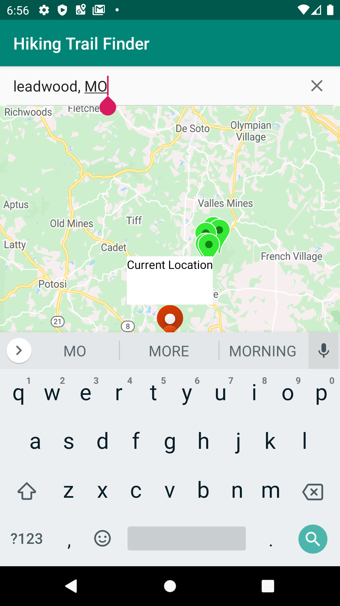

# Find Your Next Adventure!

Finding the beauties of nature is easier when you use the Hiking Trail Finder! Using GPS location, this application will display hiking 
trails in your local area. It will also provide directions to your awaiting adventure!





### Markdown

Markdown is a lightweight and easy-to-use syntax for styling your writing. It includes conventions for

```markdown
Syntax highlighted code block

# Header 1
## Header 2
### Header 3

- Bulleted
- List

1. Numbered
2. List

**Bold** and _Italic_ and `Code` text

[Link](url) and 
```

For more details see [GitHub Flavored Markdown](https://guides.github.com/features/mastering-markdown/).


