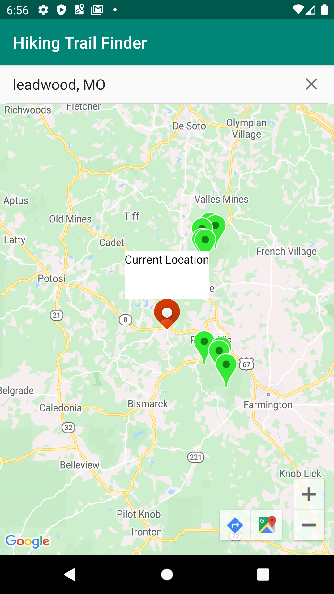
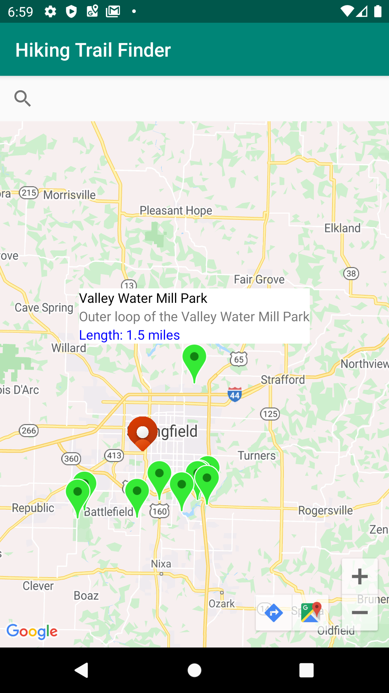
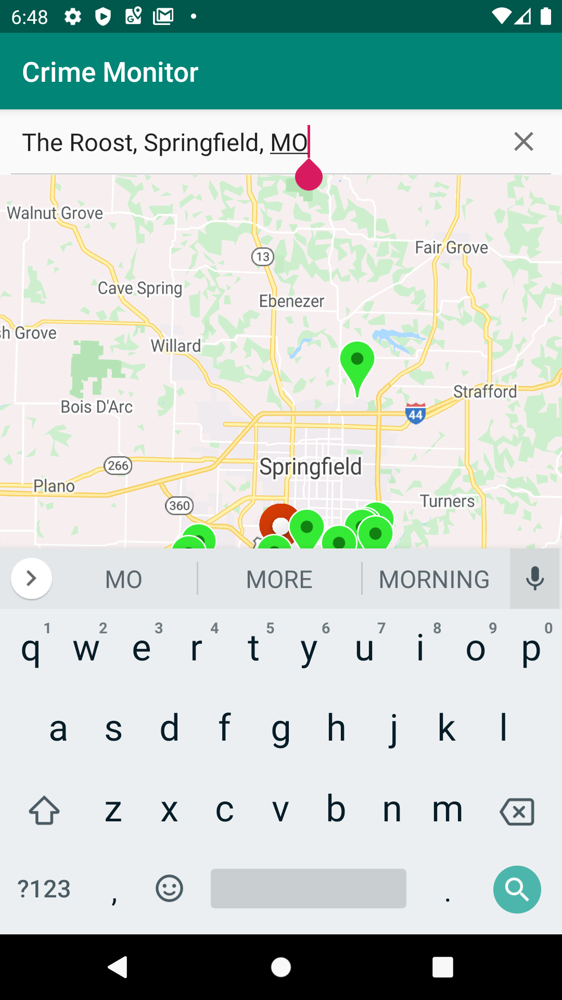

# Find Your Next Adventure!

Finding the beauties of nature is easier when you use the Hiking Trail Finder! Using GPS location, this application will display hiking 
trails in your local area. It will also provide directions to your awaiting adventure!

    

## Features
- Displays your current location
- Displays hiking trails in your area based on your current location
- Uses Google Maps to provide directions to the trail
- Allows you to search for a specific address

<button onclick="window.open('finalDemo.gif')"> See the App in Action! </button>

<a href="app-debug.apk" download>Download the Application!</a>   

